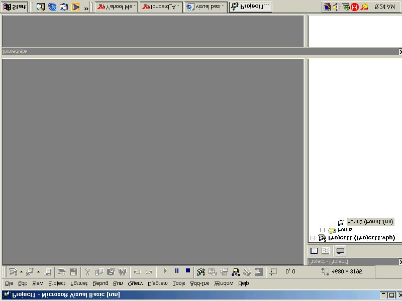



## Fake Trojan Virus

### Description

A very annoying joke, but this is a totally different type of a fake virus joke that I've found on this site. This one has everything from shutdown, flip windows, scroll windows, stretch windows, disable ctrl alt del, a very funny way to open close CD Door and much more, just check it out. Good one to scare and annoy newbies. It&#8217;s worth a try.
 
### More Info
 

             |
---                |---
**Submitted On**   |2001-09-12 19:19:32
**By**             |[Dexter Zafra](https://github.com/Planet-Source-Code/PSCIndex/blob/master/ByAuthor/dexter-zafra.md)
**Level**          |Intermediate
**User Rating**    |4.0 (32 globes from 8 users)
**Compatibility**  |VB 5\.0, VB 6\.0
**Category**       |[Jokes/ Humor](https://github.com/Planet-Source-Code/PSCIndex/blob/master/ByCategory/jokes-humor__1-40.md)
**World**          |[Visual Basic](https://github.com/Planet-Source-Code/PSCIndex/blob/master/ByWorld/visual-basic.md)
**Archive File**   |[Fake Troja266509182001\.zip](https://github.com/Planet-Source-Code/dexter-zafra-fake-trojan-virus__1-27368/archive/master.zip)

